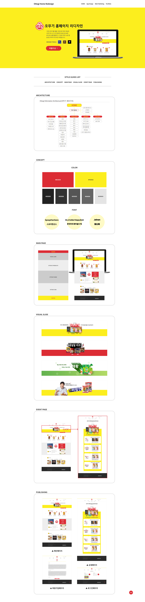
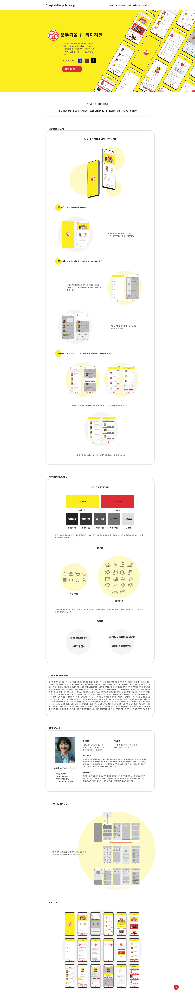

# 오뚜기 리디자인

아래 작업물들은 국비지원교육을 받으며 제작한 결과물입니다.

- 교육명 : 이젠 아카데미 - [과정평가형]UXUI 디지털디자인 및 웹디자인기능사 자격취득반

- 교육기간 : 2020/05 ~ 2020/10

 
 
 

- ## 홈페이지 리디자인 및 퍼블리싱

  - 퍼블리싱 사용 언어 : HTML, CSS, JavaScript(jQuery)
  - 디자인 사용 툴 : PhotoShop, Illustrator, Figma

 

** 스타일 가이드 **

 
 
 

- ## 모바일 앱 리디자인

  - 디자인 사용 툴 : PhotoShop, Illustrator, Figma
     

    모바일의 경우 코딩으로 구현은 하지 않고 figma를 통해 프로토타입을 보여줄 수 있도록 했습니다.

 

** 스타일 가이드 **

